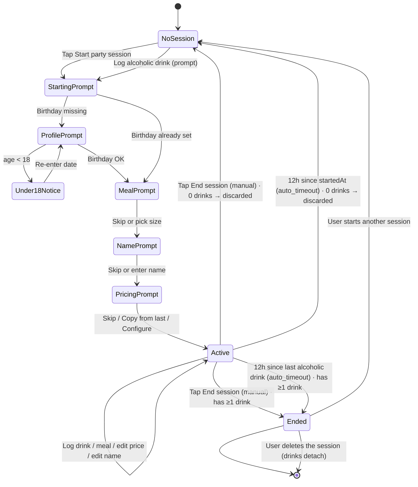
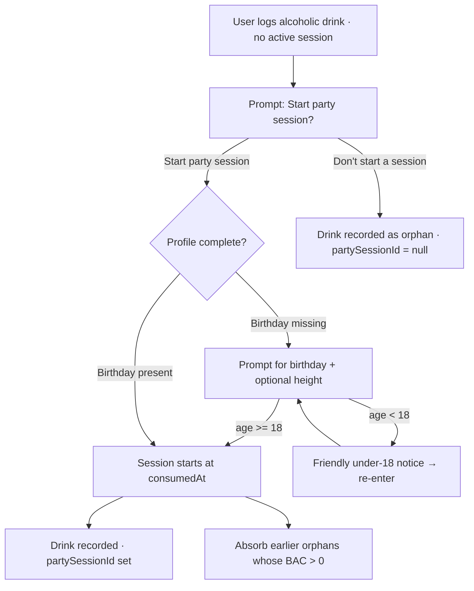
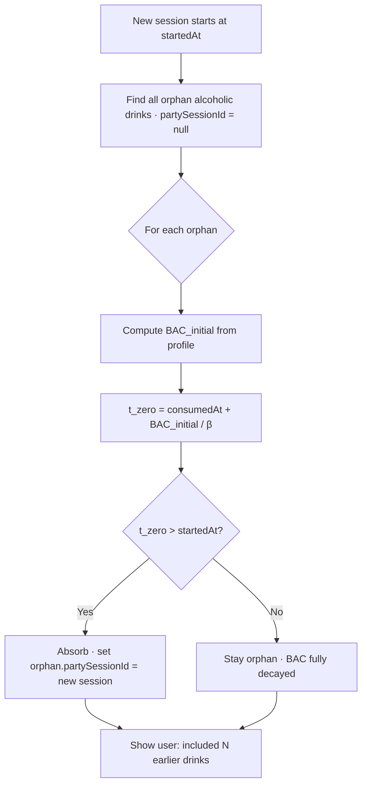

# Party Session (Phase 1)

A Party Session is an opt-in, session-based feature in phase 1. While a session is active, the user can log alcoholic drinks and see an **estimate** of their current blood alcohol concentration (BAC). The user can also set a personal cap and see when they are approaching it.

**Related docs.** Functional summary: [features.md → F12 Party Session](./features.md#f12--party-session-opt-in). Storage: [data-model.md → PartySession](./data-model.md#partysession), [→ PartySessionPrice](./data-model.md#partysessionprice), [→ Meal](./data-model.md#meal). Profile inputs: [data-model.md → UserProfile](./data-model.md#userprofile). UI surface: [user-experience.md → S7 Party](./user-experience.md#s7--party) (top-level tab; carries the active-session view and the start CTA), [→ S2 Log drink](./user-experience.md#s2--log-drink) (alcoholic types appear).

## Why session-based

Alcohol consumption is bursty — it happens on specific occasions, not continuously. An always-on "alcohol mode" would add visual noise on the many days when a user has zero alcohol. A session frames the experience: explicit start, explicit (or automatic) end, BAC UI present only when it is actually relevant.

## Display units

- **Primary unit: BAC in g/L** (the conventional everyday unit; equivalent to promille, ‰).
- **Secondary unit: mmol/L** shown alongside, smaller, as a scientifically grounded equivalent.

Example: `0.36 g/L` *(≈ 7.85 mmol/L, estimate)*.

Internally the app stores and computes BAC in `g/L`. The mmol/L value is derived for display only.

## Important: this is an estimate, not a measurement

The app produces an estimate based on published pharmacokinetic models. Real BAC depends on factors the app cannot know (genetics, recent food intake, medications, illness, hydration, drink absorption rate). Estimates can be off by tens of percent in either direction.

These rules are non-negotiable in the UI:

- The estimated BAC must **always** be presented as an estimate (e.g. "~0.33 g/L (estimate) · ≈ 7.2 mmol/L").
- The app **must never** be presented as a tool for deciding whether someone is fit to drive, operate machinery, or do anything else where BAC matters legally or medically.
- A clear, persistent disclaimer must be visible during an active session: this is informational only; do not use it as a basis for driving decisions.
- The user's chosen cap is a personal goal, not a safety threshold.

## Session lifecycle

### Lifecycle diagram



### Starting a session

- The user taps **"Start party session"** on the [Party tab](./user-experience.md#s7--party).
- **If birthday is missing from the profile:** the app prompts for it. The same prompt offers a skippable height field. The user can cancel without starting a session. If the entered birthday makes the user under 18, the app **notifies the user** with an honest, non-accusatory message ("Party Mode requires you to be 18 or older. If you entered your birthday incorrectly, you can try again.") and lets them re-enter the date. There is no retry limit — the birthday cannot be validated either way, and adding friction does not change that.
- **If birthday is present and the user is 18+:** the session starts without further profile prompts.
- The start flow includes a single, skippable **meal prompt** (see "Meals" below). It is the only food question the app ever asks during a session.
- The start flow also includes an optional, skippable **name** field (e.g. "Sarah's birthday"), stored on `PartySession.name`. Skipping leaves it unset — the past-sessions list falls back to showing just the date/range. The name can be added or changed at any later point too, not just at start: from the Party tab while the session is active, or from [S9](./user-experience.md#s9--party-session-log)'s ended-mode header once it has ended.
- A session has a `startedAt` timestamp and is the *active* session until it ends. There is at most one active session at a time.

### During a session

- The [Party tab](./user-experience.md#s7--party) displays the active-session view: current estimated BAC, projected decay, optional cap progress, drinks-this-session count and total grams of alcohol.
- The log-drink flow ([user-experience.md → S2 Log drink](./user-experience.md#s2--log-drink)) shows the alcoholic beverage types alongside the non-alcoholic ones.
- Session-only notifications (approaching cap, sober estimate) are eligible to fire — see "Notifications during a session" below.

### Ending a session

A session ends in one of two ways:

1. **Manually.** The user taps **"End session"** on the [Party tab](./user-experience.md#s7--party). `endReason = manual`.
2. **Automatically.** The session auto-ends **12 hours after the most recently logged alcoholic drink** (or 12 hours after `startedAt` if no alcoholic drinks were logged). `endReason = auto_timeout`. `endedAt` is set to that 12-hour mark, not to the time the app happened to notice.

12 hours is long enough that an evening followed by sleeping in counts as one session, and short enough that a session doesn't bleed into the next day for someone who logged a single beer at lunch.

When a session ends:

- The Party tab reverts to its no-active-session state (full-width "Start party session" button + past sessions list).
- The alcoholic beverage types disappear from the log-drink flow (the user can still log non-alcoholic drinks as normal).
- The session and its drinks remain visible in history — **unless** it had zero alcoholic drinks, in which case it is discarded instead of kept; see "Zero-drink sessions are never saved" below.

#### Zero-drink sessions are never saved

If, at the moment a session would end (manual tap **or** the 12-hour auto-timeout check), it has **zero alcoholic drinks** — none logged in-session and none absorbed as orphans — the session is discarded instead: it is soft-deleted immediately, with no confirmation prompt, and the Party tab goes straight to the no-active-session state. It never appears in the past-sessions list or history. This covers the case of starting a session and never getting around to logging anything. See [data-model.md → PartySession → Zero-drink sessions are discarded](./data-model.md#zero-drink-sessions-are-discarded-not-saved).

**Deliberate: meals do not exempt a session from discard.** A session can carry meals with zero drinks (a user can log a meal before logging any alcohol). The zero-drinks check above is drink-count-only — a meal-only session is still discarded silently, and its meal record is lost along with it. Considered and accepted: this is a rare, low-stakes edge case, not worth interrupting the flow for a confirmation prompt.

#### Deleting a session

Only an **ended** session can be deleted — there is no delete affordance on the active session; end it first. Delete is offered from [S9](./user-experience.md#s9--party-session-log)'s ended-mode header only — the single entry point for this action (the past-sessions list row carries no delete affordance; tapping a row there only opens S9), with a confirmation prompt (same pattern as deleting a drink entry). Deleting a session soft-deletes the `PartySession` row and **detaches** every drink that belonged to it — each entry's `partySessionId` is cleared, turning them back into ordinary orphan drinks. The drinks are never deleted themselves and remain visible in today's log / history exactly as any other orphan. See [data-model.md → PartySession → Deleting a session](./data-model.md#deleting-a-session).

### Auto-end is computed lazily

We do not run a background timer. The auto-end check runs whenever:

- The app is foregrounded.
- The Today, Party, or History tab is opened.
- A drink is logged.
- Settings are opened.

If the check determines the active session should have ended, it ends it retroactively (with `endedAt` set to the correct 12-hour mark, not "now"). This means a user who closes the app for a week and returns will not see a still-active session: if the session had logged drinks, it shows up correctly-ended in history; if it had zero drinks (started, then abandoned), it is discarded per "Zero-drink sessions are never saved" above and the user simply lands on the no-active-session state.

### Logging alcohol when no session is active

This section describes the **Party tab's** dedicated "Log alcohol" action, which blocks on the prompt below before the drink is recorded. Logging alcohol from Today (the quick-log grid tile or the S2 drawer) works differently — see [Logging from Today](#logging-from-today-quick-log-tile-and-s2-drawer) below.



The app **does not** silently start a session. When the user logs an alcoholic drink while no session is active, the app explicitly **asks** them whether to start a party session for it:

- A confirmation prompt appears with two clear choices: **"Start party session"** or **"Don't start a session"**.
- If the user chooses to start a session: the session begins at the drink's `consumedAt` time, the drink is recorded, and BAC tracking takes over. If profile inputs are missing (first-ever alcohol log), the prompt to enter them comes next, and the session only starts after the user provides them.
- If the user chooses not to start a session: the drink is recorded as an **orphan drink** and is visible in [today's drinks log](./user-experience.md#s6--today-drinks-log) and history, but no session is created and no BAC estimate is shown.

The choice is presented every time alcohol is logged outside an active session via the Party tab — we never assume the answer for the user. The decision to drink, and the decision to track that drink in a session with a BAC estimate, are deliberately kept separate.

#### Logging from Today (quick-log tile and S2 drawer)

Today's quick-log grid tiles and the [S2 log-drink drawer](./user-experience.md#s2--log-drink) log an alcoholic entry **immediately**, never blocking on a start-session prompt — consistent with every other drink's 1–3 tap flow (see [Flow 2](./user-experience.md#flow-2--quick-log-most-common)).

- **No active session:** the drink logs as an orphan, and its toast offers **"Start session"** in place of the usual Undo (one action fits a toast). Tapping it starts a session and absorbs the drink immediately, since its BAC hasn't decayed yet. Left un-started, the drink stays an orphan but isn't locked out — any later session still absorbs it under the normal rule (see [Absorbing orphan drinks](#absorbing-orphan-drinks-when-a-later-session-starts)). To remove it instead, delete it from [S6](./user-experience.md#s6--today-drinks-log).
- **A session is already active:** the drink attaches to it directly, same as the Party tab's own "Log alcohol" action, and the BAC estimate updates. The toast is ordinary — Undo, no "Start session".

### Absorbing orphan drinks when a later session starts



When the user later starts a session (manually, or by accepting the prompt on a subsequent alcohol log), any pre-existing orphan drinks whose alcohol is **still pharmacokinetically active** are absorbed into the new session.

The rule is applied **per orphan drink**:

- For each orphan drink, compute its individual `BAC_initial` using the user's profile (Step 3 of the algorithm).
- Compute the time at which that individual contribution would decay to zero: `t_zero = consumedAt + BAC_initial / β`.
- If `t_zero > startedAt` of the new session, the orphan still has residual BAC and is absorbed: the drink's `consumedAt` falls within the session's `[startedAt, endedAt)` window for BAC computation, and it appears in the session's drink list ([user-experience.md → S9 Party Session Log](./user-experience.md#s9--party-session-log)).
- Otherwise the orphan has fully decayed and stays orphaned. It remains visible in history but does not contribute to the new session.

`BAC_initial / β` is just the time the model says it takes that drink's contribution to reach 0 from its peak, used here only as the absorb/discard cutoff. We do not need to track partial decay separately for this check — once absorbed, the drink's `consumedAt`/`BAC_initial` feed into the pooled Step 5 calculation like any other session drink, which handles a partially-decayed drink correctly.

This per-orphan `t_zero` check is itself a per-drink-independent-decay approximation — the same kind Step 5 deliberately moved away from — applied only to decide absorb-vs-discard for orphans considered one at a time. With two or more overlapping orphans (e.g. logged close together, each below the discard threshold alone but still summing to residual BAC in the now-canonical pooled model), this check can discard an orphan whose alcohol a pooled read of the pre-session drinks would still count. Known, accepted approximation for Phase 1, not something Step 5's pooling fix addresses — revisit if orphan absorption proves to under-count in practice.

#### Implications

- **Absorbed orphans extend backwards in time.** A session can contain drinks whose `consumedAt` is earlier than `startedAt`. This is intentional: the session window is an organisational concept, while the BAC math reflects the actual residual alcohol in the user's bloodstream.
- **Auto-end timing.** The 12-hour auto-end clock is still measured from "the most recently logged alcoholic drink within the session". Absorbed orphans are by definition older than `startedAt`, so they will not extend the auto-end further than an in-session drink would. If the session has only absorbed orphans and no in-session drinks, the auto-end fires 12 hours after the most recent absorbed orphan — which may be earlier than `startedAt + 12h`. That is correct.
- **User transparency.** When orphan drinks are absorbed into a starting session, the start confirmation should tell the user (e.g. "Session started — included 2 earlier drinks that are still affecting your estimate"). The user must understand that the BAC they see accounts for drinks they declined to track at the time.
- **No opt-out.** Absorption is fully automatic: every orphan whose BAC has not yet decayed to 0 is absorbed into the new session. The user cannot uncheck individual drinks. The estimate is meant to reflect what is actually in the user's bloodstream per the model; letting the user hide drinks from the calculation would undermine the integrity of the estimate. The start-session confirmation tells the user clearly which drinks were absorbed.

## Required user inputs

The BAC estimate uses the user's profile, which is partly collected during onboarding ([user-experience.md → S5 Onboarding](./user-experience.md#s5--onboarding-first-launch-only)) and partly completed the first time the user tries to start a Party Session. Stored in [data-model.md → UserProfile](./data-model.md#userprofile).

| Field        | Required for Party Mode? | Source                                               | Used for                              |
| ------------ | ------------------------ | ---------------------------------------------------- | ------------------------------------- |
| `gender`     | Yes                      | Onboarding                                           | Sex-specific Widmark `r` and Watson coefficients |
| `weightKg`   | Yes                      | Onboarding (default 70)                              | Both Widmark and Watson               |
| `birthDate`  | **Yes**                  | Onboarding (optional) or first-session prompt        | 18+ gate; age input for Watson        |
| `heightCm`   | No (recommended)         | Onboarding (optional) or first-session prompt        | Watson model (improves accuracy)      |

**Gender — three options.** `male` / `female` / `unspecified`. Body composition differs significantly between male and female and is one of the biggest factors in BAC for a given dose, so the calculation needs *some* answer. The unspecified case is handled below.

**Birthday is required to use Party Mode.** If the user did not provide it during onboarding, the app prompts for it the first time they tap "Start party session". The same prompt offers `Height (optional, improves accuracy)` with a clear skip. The birthday cannot actually be validated — the app just trusts what's entered. If the resulting age is under 18 (or the locally configured age of majority), the app shows a friendly message and lets the user re-enter the date; there is no retry limit, and there is no permanent lockout — the gate is informational, not enforcement.

**Gender — unspecified handling.** When the user picks `unspecified`, both the Widmark and Watson paths use the **conservative (female) factor / coefficients** so the resulting BAC estimate is the higher of the two possibilities. A small footnote alongside the BAC value explains this ("Estimate uses a conservative model since gender isn't specified").

**Algorithm choice is data-driven.** When both birthday and height are present, the app uses the Watson TBW model. When height is missing, it falls back to Widmark. There is no user-facing setting to choose between them — the app picks the most accurate option the available data supports. See "BAC estimation algorithm" below.

The user can change any profile value at any time from settings; subsequent BAC estimates use the new values, but already-recorded sessions are not retroactively recomputed.

## Meals

Stored as [data-model.md → Meal](./data-model.md#meal) records, scoped to a single `PartySession`.

Food in the stomach slows alcohol absorption, lowering peak BAC and shifting it later in time. The app accounts for this in a deliberately lightweight way — meals are a small part of the experience, not leading.

### What we ask

A single, skippable prompt at session start: **"Did you eat recently? Small / Medium / Large / Skip"**. Skipping means "we don't know — assume worst case, no food modifier".

The user can also **add a meal at any time during the session** from the [Party tab](./user-experience.md#s7--party). There is **never** a per-drink food prompt.

### Meal sizes

The user picks a bucket; the descriptive cue is leading, weight and calories are supporting guidance:

| Size   | Examples                                              | Rough mass    | Rough kcal     | Peak modifier | Time constant τ |
| ------ | ----------------------------------------------------- | ------------- | -------------- | ------------- | --------------- |
| Small  | Snack, sandwich, light salad                          | ~150–300 g    | ~200–400 kcal  | 0.95          | 1.5 h           |
| Medium | Normal meal: plate of pasta, sandwich + soup          | ~400–700 g    | ~500–800 kcal  | 0.85          | 2.5 h           |
| Large  | Heavy meal: stew with rice, multiple courses, roast   | ~800 g+       | ~900+ kcal     | 0.75          | 3.5 h           |

The **peak modifier** is the value at `eatenAt`, when food's effect on absorption is strongest. The **time constant τ** is the gastric-emptying half-life-style parameter that controls how fast the modifier returns to 1.00 — see "How meals affect the BAC estimate" below for the formula.

Practically: at `Δt = τ` the modifier has recovered ~63% of the way back to 1.00; at `Δt = 3τ` it has recovered ~95%; at `Δt = 5τ` (~7.5 h / 12.5 h / 17.5 h) it is within 1% of 1.00 and the effect is negligible.

**Caveat we should be honest about in the UI copy:** what actually slows absorption is *gastric emptying time*, which depends on calories and fat/protein content more than raw weight. The buckets are a usable approximation, not a precise science. The descriptions above should appear in the picker so the user has anchors.

Bucket boundaries and time constants are confirmed; the τ values land within published gastric-emptying ranges for mixed meals (~60–180 min).

### Each meal stores

- A **size** (`small` / `medium` / `large`).
- An **`eatenAt`** timestamp — defaults to "now" at the moment of logging, adjustable by the user (e.g. "I ate an hour ago"). Most users will accept the default.

A session can contain zero, one, or several meals. A meal logged mid-session attaches to the current session.

### How meals affect the BAC estimate

For each alcoholic drink at time `t_drink`, look at every meal attached to the active session and compute that meal's current modifier using exponential decay:

```
Δt = t_drink − eatenAt          (in hours)

if Δt < 0:
    modifier_meal = 1.00          (meal hasn't been eaten yet at t_drink)
else:
    modifier_meal = 1.00 − (1.00 − peak) × exp(−Δt / τ)
```

`peak` and `τ` are the values for that meal's size (see the table above). The modifier starts at `peak` at `eatenAt` and decays exponentially back toward 1.00 as the food empties from the stomach. It never exceeds 1.00 and never drops below `peak`.

If multiple meals are attached to the session, take the **smallest** modifier across all of them — that meal is the one most slowing absorption right now. (Equivalently: the meal with the strongest still-active effect wins.)

```
modifier = min over all session meals of modifier_meal_i
```

Apply the modifier to that drink's `BAC_initial`:

```
BAC_initial' = BAC_initial × modifier
```

Then continue with the elimination model (Step 4 onward). Each drink can carry a different modifier depending on which meals are still effective when it is consumed.

#### Practical cutoff

`exp()` is cheap, so the implementation can simply evaluate every session meal at every drink-time. If a cutoff is wanted (e.g. to skip meals that are obviously irrelevant), `Δt > 5 × τ_largest` is a safe threshold — at that point every meal's modifier is within 1% of 1.00 and contributes negligibly.

### Honest caveat about the model

Multiplying `BAC_initial` lowers the peak *and* shortens time-to-zero, which understates the total area under the BAC curve (AUC). Physiologically, food primarily *slows* absorption rather than reducing total alcohol exposure. A more accurate model would use a real absorption curve, but that requires additional parameters (drink volume rate, meal composition) that are out of scope for phase 1. The simple multiplicative approach is a usable approximation; we should not claim more accuracy than it delivers.

The chosen multipliers (0.95 / 0.85 / 0.75) are conservative compared to published peak-BAC reductions (literature shows 30–50% reductions in some studies), specifically because the simple model already omits absorption dynamics — over-correcting would compound the error in the optimistic direction.

### Meals from previous sessions

For simplicity, only meals attached to the **active** session contribute to the modifier. A meal logged in a previous session that would technically still be in window does not carry over. This is a known small inaccuracy, accepted in exchange for a clean session-scoped model.

## Pricing during a session

Stored as [data-model.md → PartySessionPrice](./data-model.md#partysessionprice) override rows, with the session's token configuration on [PartySession](./data-model.md#partysession).

Festivals, bars, and house parties usually have different prices than a user's normal-day reference (and often use a token system instead of money). Party Mode supports both without ever modifying the user's regular drink presets.

### Concept

Each `DrinkPreset` carries a single **regular price** (the menu price). On top of that, an active session can carry **per-session price overrides** — one per preset — that replace the regular price while the session is active and `useSessionPrices` is on. Overrides live with the session, not on the preset, so the user's day-to-day pricing is never disturbed and historical sessions retain the prices that were actually applied.

The user-facing presentation is the mental-model the user described: a table where each drink shows its **regular price** in one column and its **party price** in another, with the party-price column editable while a session is active.

### Money vs tokens

Each session-price override is **either** a money amount **or** a token amount, not both. So a single session can mix freely — beer in tokens, water in cash — but a single drink within a session has one currency-of-payment.

The session itself carries a token configuration:

- **Token name** — what to call them in the UI ("Token", "Munt", "Drink ticket"). Optional; defaults to "Token".
- **Token value** — what one token is worth, in money. Optional. When set, the app can show a money-equivalent total alongside the token total. When unset, token spending is simply not summed in money.

Both live on `PartySession` (see [data-model.md → PartySession](./data-model.md#partysession)) and can be configured at session start or any time during the session.

### Starting a session — pricing prompt

When the user starts a session, the start flow includes a brief pricing step:

1. **Copy prices from your last session?** If the user has at least one previous session with overrides, this option is offered. Choosing yes copies the most recently *ended* session's `PartySessionPrice` rows into the new session, including currency / tokens. Choosing no starts with no overrides — every drink defaults to its regular price.
2. **Token configuration** — name, value (optional). Pre-filled from the previous session if "copy from last session" was chosen.

The whole pricing step is itself skippable in one tap ("Skip — use regular prices") for users who don't care about pricing.

### Editing prices during a session

The Party tab (active-session view) exposes a "Manage prices" action that opens the per-session price table:

- One row per `DrinkPreset` (excluding hidden ones), showing: drink name + icon, regular price (read-only, for reference), party price (editable, this session only).
- Tapping a party-price cell opens an editor: pick **money** (amount + currency, defaults to the user's preferred currency) or **tokens** (count). Pick "no override" to fall back to the regular price for this drink.
- Edits are saved immediately and apply to subsequent log actions in this session, **and retroactively** to every drink already logged in this session from that preset — its `priceMinor`/`priceTokens`/`currency` snapshot is rewritten to match what a fresh log action would resolve to right now (falling back to the regular price when "no override" is picked, or when the "use session prices" toggle is off).
- **Exception:** an entry that was given its own one-off, this-entry-only price override (the log-time price field on the Party log-alcohol sheet, or a per-entry price edit from S6/S9) is skipped by the retroactive sweep. A deliberate per-entry edit always wins over the session-wide table — the two price-editing mechanisms never fight each other.

**Critical invariant:** edits made here only ever touch `PartySessionPrice` rows and, via the retroactive sweep above, non-overridden `DrinkEntry` rows on the active session. The `DrinkPreset.regularPrice*` fields are never modified by Party Mode actions.

### Toggle: use session prices

A toggle on the Party tab's active-session view lets the user switch session pricing on or off live:

- **On** (default if any overrides exist at session start): drinks logged in this session use the session override if one exists, falling back to the preset's regular price.
- **Off**: drinks log at their regular price even though overrides exist. Useful when the user temporarily steps out of the festival context (e.g. drove home, opens the fridge).

The toggle is session-scoped state; it does not persist across sessions.

### What gets snapshotted onto the drink

When a drink is logged during a session, the price snapshot on the resulting `DrinkEntry` reflects what was actually applied at that moment:

- If money was applied: `priceMinor` + `currency` are set; the token fields are null.
- If tokens were applied: `priceTokens` + `tokenValueMinor` + `tokenValueCurrency` are set (the token value snapshot lets historical aggregations show a money-equivalent even if the session's token configuration changes later); `priceMinor` and `currency` are null.

This mostly follows the [log immutability principle](./data-model.md#snapshot-semantics--log-immutability), with one deliberate exception: a party-price edit (see "Editing prices during a session" above) retroactively rewrites this snapshot on already-logged, non-overridden entries for the affected preset. A per-entry price edit (S6, S9, or the log-time one-off override) still behaves as an ordinary immutable snapshot from every other actor's perspective.

### Aggregations across mixed payment

Per-session totals are shown grouped, the same way the app handles mixed currencies:

- "Spent: €18.50" (sum of money-paid drinks, grouped by currency)
- "Tokens used: 7" (sum of token-paid drinks)
- "Token value: ≈ €10.50" (only shown if `tokenValueMinor` is set on the session)

No conversion is attempted across currencies. The user sees the breakdown they actually paid.

## Logging an alcoholic drink (during a session)

The log-drink drawer ([user-experience.md → S2 Log drink](./user-experience.md#s2--log-drink)) gains:

- **Alcoholic beverage types**: `beer`, `wine`, `spirit`, `cocktail`, `other_alcohol`. Each has a default ABV (alcohol by volume, %), which the user can override per entry.
  - `beer` — default 5.0% ABV.
  - `wine` — default 12.0% ABV.
  - `spirit` — default 40.0% ABV.
  - `cocktail` — no default; user must enter ABV.
  - `other_alcohol` — user enters ABV.
  - `[OPEN]` — confirm defaults; these are reasonable European starting points.
- **ABV override** — the user can override the ABV for any entry (e.g. a strong IPA at 8%).
- **Volume** — already part of the standard flow.

The Party tab's own log-alcohol sheet (used for the "Log alcohol" action on [S7](./user-experience.md#s7--party)) additionally carries **name** and **price** fields, per-entry — the one-off, this-entry-only customisation that [S2's Advanced editor](./user-experience.md#s2--log-drink) no longer offers for any drink type. A price entered here is a **one-off override for this entry only** — it never writes to the session-wide `PartySessionPrice` table, matching how a per-entry price edit works everywhere else (S6, S9): the regular preset price, the session-wide override, and a single entry's one-off override are three independent layers, each writable only from its own dedicated UI.

Non-alcoholic drinks are logged exactly as outside a session and contribute to hydration as usual. They do not lower the BAC estimate (see "Hydration does not lower BAC" below).

## BAC estimation algorithm

The estimate is computed from the alcoholic drink entries belonging to the active session, plus the user's profile.

### Step 1 — grams of pure alcohol per drink

For each alcoholic drink entry:

```
alcohol_grams = volume_ml × (abv_percent / 100) × 0.789
```

`0.789 g/mL` is the density of ethanol at room temperature.

### Step 2 — distribution volume

The choice of model is **data-driven**, not user-selectable. The app picks the most accurate option that the available profile data supports:

- **Watson TBW model** — used when both `heightCm` and `birthDate` are present (so age can be derived). Documented in the literature as ~15–20% more accurate than Widmark because it accounts for individual body composition rather than using a fixed `r` value.

  ```
  age_years    = floor((today − birthDate) / 365.25)
  TBW_male_L   = 2.447 − 0.09516 × age_years + 0.1074 × height_cm + 0.3362 × weight_kg
  TBW_female_L = −2.097 + 0.1069  × height_cm + 0.2466  × weight_kg
  ```

  Watson is validated for adults with BMI ≈ 17–67 (men) / 17–80 (women). When the user's computed BMI falls outside that range, the UI shows a small inline warning alongside the BAC value: *"BAC estimates may be less accurate for users outside typical body composition ranges."* The warning is informational only — the algorithm still computes and displays the estimate normally. Concretely:

  - Warn if `BMI < 17` (any gender).
  - Warn if `BMI > 67` and gender is `male`.
  - Warn if `BMI > 80` and gender is `female` or `unspecified` (unspecified follows the conservative path, see above).

  The warning only fires on the Watson path — when height is missing and BAC falls back to Widmark, no BMI can be computed and no warning is shown.

- **Widmark fallback** — used when height is missing (which is the only optional field for Party Mode; birthday is required, so age is always available). Uses the classic 1932 distribution-ratio approach:

  ```
  r = 0.68 (male), 0.55 (female), 0.55 (unspecified — conservative)
  ```

  When the unspecified-gender path is taken, the BAC display includes the explanatory footnote described above.

### Step 3 — initial BAC (g/L)

Per drink, with `meal_modifier` as described in the "Meals" section above (`1.00` if no meal applies, otherwise the exponentially-decaying value at `t_drink`):

- **Watson path** (height available):
  ```
  BAC_initial_g_per_L = (alcohol_grams × 0.806) / TBW_L × meal_modifier
  ```
  `0.806` is the water fraction of whole blood, which converts the TBW-distributed concentration to a blood concentration.

- **Widmark fallback** (height missing):
  ```
  BAC_initial_g_per_L = alcohol_grams / (weight_kg × r) × meal_modifier
  ```

### Step 4 — elimination over time

The body eliminates alcohol at a roughly linear rate (zero-order kinetics) once absorbed. Use:

```
β = 0.15 g/L per hour   (default)
```

`β` typically ranges from 0.10 to 0.20 g/L/h across individuals. `0.15` is a common midpoint used in forensic and educational calculators.

### Step 5 — current BAC

For a single drink consumed at time `t_drink`:

```
BAC(t) = max(0, BAC_initial − β × (t − t_drink))
```

For multiple drinks, the body eliminates alcohol at one fixed rate `β` regardless of how many drinks contributed to it — fold every drink into a single running pool rather than summing each drink's independently-decaying contribution. Process drinks in consumption order: decay the pool at `β` for the elapsed time since the previous drink (floored at 0), then add the new drink's own `BAC_initial`; the current estimate is that pool decayed at `β` from the last drink to now (floored at 0).

Summing each drink's contribution independently — a natural-looking simplification — over-eliminates: whenever `N` drinks are each still individually above 0, the effective elimination rate becomes `N × β` instead of the fixed `β` the body actually uses, so a dense session (many drinks close together) crashes to an implausible `0 g/L` while drinking is still ongoing. The pooled model avoids this. The two models agree whenever there's no overlap between drinks — either they're logged at the exact same instant (zero elapsed decay to disagree over, as in the two-beer worked example below), or each drink's contribution has already fully decayed to 0 before the next is logged (nothing left to double-eliminate) — and diverge only in between, while more than one drink's contribution is still positive at once.

Phase 1 uses an **immediate-absorption** model: each drink's alcohol is treated as entering the bloodstream at `consumedAt`, with the meal modifier (see "Meals") capturing the bulk of food's effect on peak BAC. A more physiologically accurate delayed-absorption model would require additional inputs per drink (drink type beyond ABV, sipping rate, recent food state) that hurt the fast-logging goal and aren't justified for an estimate that already carries strong disclaimers. Worth revisiting in a later phase if the existing inputs prove insufficient.

### Step 6 — formats for display

The app shows BAC in `g/L` as the primary value and `mmol/L` as a secondary value:

```
BAC_mmol_per_L = BAC_g_per_L × 21.7
```

`g/L` is the canonical internal unit; `mmol/L` is derived only at the display boundary.

### Worked example (sanity check)

A 75 kg, 180 cm, 30-year-old male starts a session and drinks two 250 ml beers at 5% ABV at the same time.

- Alcohol per beer: `250 × 0.05 × 0.789 = 9.86 g`
- Total alcohol: `19.73 g`
- TBW: `2.447 − 0.09516 × 30 + 0.1074 × 180 + 0.3362 × 75 = 43.93 L`
- BAC initial: `(19.73 × 0.806) / 43.93 = 0.362 g/L (≈ 7.85 mmol/L)`
- After 2 hours: `0.362 − 0.15 × 2 = 0.062 g/L (≈ 1.34 mmol/L)`
- After ~2.4 hours: ~0 g/L
- If no further alcohol is logged, the session auto-ends 12 hours after that last beer's `consumedAt`.

## BAC goal (cap)

- The user can set a personal cap, configured in settings, expressed in **g/L** (with the mmol/L equivalent shown). Default: **off** (no cap).
- The cap is a single persistent setting and applies whenever a session is active. It is not per-session.
- During an active session the [Party tab](./user-experience.md#s7--party) shows current estimated BAC versus the cap, with a clear visual indicator when the user is approaching or above the cap.
- The "approaching cap" notification fires when a logged drink pushes the estimated BAC to **80% or more** of the cap (inclusive boundary — see Parity Rulebook "Approaching-cap trigger").
- The cap is a personal goal, not a legal threshold. The UI must not present it as a "safe to drive" line under any circumstances.

### Relation to legal limits

For reference only — these are **not** built into the cap behaviour:

- Netherlands: 0.5 g/L (≈10.85 mmol/L) for experienced drivers, 0.2 g/L (≈4.34 mmol/L) for novice drivers.
- Many other EU countries: 0.5 g/L.

Settings show these limits as reference values inside the Party Mode section, with a strong "informational only" framing — they help the user place their cap in context, not to indicate fitness to drive.

## Notifications during a session

When a session is active, the standard hydration reminders ([notifications.md](./notifications.md)) continue to behave as normal. Two additional notifications, both off by default, become eligible to fire:

- **Approaching cap.** When the user logs a drink that pushes the estimated BAC to **80% or more** of the cap (inclusive), the app sends a notification.
- **Sober estimate.** When the estimated BAC returns to 0 g/L, the app sends a single notification ("Estimated BAC is back to 0 — remember this is an estimate."). The user can disable this independently.

When the session ends (manually or automatically), neither of these notifications fires until a new session is active.

## Party tab during a session

When a session is active, the [Party tab](./user-experience.md#s7--party) displays an active-session view containing:

- A **summary card** at the top: current estimated BAC in **g/L** (large, clearly labelled "estimate") with the **mmol/L** equivalent shown smaller alongside, the user's cap (if set, same g/L primary / mmol/L secondary format with progress toward it), and time elapsed since the session started. If the session has a name (see "Starting a session" above), it is shown here too. **The entire card is tappable** and opens [user-experience.md → S9 Party Session Log](./user-experience.md#s9--party-session-log), the itemised, editable list of this session's drinks — the same destination the drinks-count line below opens.
- A **BAC line chart** plotting the estimated BAC over time (see "BAC line chart" below), in its own card directly below the summary card. The chart has its own tap-to-inspect-value interaction (see "Tap to inspect a value" below) and does **not** open S9 — its tap target is reserved for that, distinct from the summary card above it.
- A **quick-log widget for alcohol**, directly below the BAC line chart card: the same two-tap-to-log pattern as [S1's "Quick Log" grid](./user-experience.md#s1--today-home), scoped to alcoholic presets only. Shows the **top 2** alcoholic presets, always sorted by most-recently-used (automatic — no manual reordering), no scrolling. Tapping a tile logs that preset directly into the active session, same as the "Log alcohol" action.
- Number of alcoholic drinks logged this session and total grams of alcohol. This line is tappable and opens S9, same as the summary card above.
- A small **meal indicator** showing the most recent meal logged in this session (size + relative time, e.g. "Medium meal · 2 h ago"). Tapping it opens an action to log a new meal or edit the last one. If no meal has been logged, the same control reads "Add meal".
- A **session-prices control**: a small toggle showing the current `useSessionPrices` state and a "Manage prices" link that opens the per-session price table. When session prices are off but overrides exist, the toggle reads "Session prices: off — using regular prices".
- A **session totals** strip showing money spent (grouped by currency) and tokens used so far in this session. The token value money-equivalent is shown if `tokenValueMinor` is set.
- A full-width **"Log alcohol"** action, persistent at the bottom of the screen (sitting above the tab bar, outside the scrolling content) — same sticky treatment as S1's "Log drink" button. **End session** stays as an ordinary in-flow action above it, not sticky.

### BAC line chart

A line chart inside the active-session section visualising the estimated BAC over the session's lifetime plus its projected decay.

**Time axis (X)**
- Starts at the session's `startedAt`.
- Ends at the **projected return-to-zero time** — the moment the model says the BAC will be back to 0 g/L given the drinks logged so far. The end time is **rounded up to the next 30 minutes** so the axis sits on a tidy mark (e.g. predicted 02:47 → axis ends at 03:00; predicted 02:05 → axis ends at 02:30).
- Tick labels are rendered as **24-hour digital time in the device's local timezone** (e.g. `21:30`, `22:00`, `23:00`). Tick spacing is chosen automatically based on total span: every 30 min for spans under ~3 h, every hour for ~3–8 h, every 2 hours beyond that.

**Value axis (Y)**
- BAC in **g/L** as the primary scale.
- mmol/L shown as the secondary scale on the opposite side of the axis (or as a tooltip label, depending on layout density).
- The user's cap is drawn as a horizontal dashed line if set.

**The line itself**
- **Solid** segment: from `startedAt` to **now**. Plots the actual estimate based on drinks already logged.
- **Dashed** segment: from **now** to the rounded end time. This is the projection. The dashed segment also has a **subtle red tint** in the chart background behind it (a low-opacity red wash on the plot area to the right of "now"). The visual signal: solid + clear background = past/present, dashed + reddish background = predicted.
- A subtle vertical reference line at "now" marks the transition.

**Empty state**
- The chart area is reserved and rendered from the moment the session starts, even before any drink is logged — this avoids a layout jump when the first drink lands. Before the first alcoholic drink, it shows a **flat line at 0.00 g/L** across a default three-hour window (`startedAt` to `startedAt + 3h`), with no dashed projection segment (there is nothing to project yet) and no "now" marker. The user's cap, if set, still draws as a dashed horizontal reference line. The moment the first drink is logged, the chart switches to the normal solid/dashed rendering described above, re-scaled to the real projected end time.

**Tap to inspect a value**
- Tapping anywhere on the chart (solid or dashed segment) renders a vertical marker line at the tapped time and a small label showing the estimated BAC (g/L, with mmol/L alongside) at that point. Tapping elsewhere on the chart moves the marker; tapping outside the chart dismisses it. This is a chart-local interaction — it never navigates away from the Party tab, and is independent of the summary block's tap-to-open-S9 behaviour described below.

**Re-rendering**
- The chart re-renders whenever a drink is added, edited, or deleted in the session, when the meal modifier changes, or when "now" advances enough that the rounded end-time would change.

When no session is active, the Party tab shows a no-active-session state instead — a full-width **Start party session** button plus, on subsequent visits, a list of past sessions. The first time the user opens the tab they also see a brief explainer of what Party Mode is, including the "this is an estimate" disclaimer. See [user-experience.md → S7 Party](./user-experience.md#s7--party) for the canonical content list.

Party Mode is a secondary feature: it occupies its own tab so users can find it when they want it, while never appearing on the Today screen. Hydration is the headline of the app; Party Mode is available when needed.

## Hydration does not lower BAC

A common misconception: drinking water does not speed up alcohol elimination. The body metabolises ethanol at a near-constant rate regardless of hydration. The app must not imply otherwise:

- Logging a glass of water does **not** reduce the displayed BAC estimate.
- Notification copy during a session must avoid suggesting that drinking water "sobers you up". Hydration reminders during a session are still useful for general hydration, and the copy should reflect that honestly.

## Data we will not collect

Party sessions do not ask for, and the app does not store:

- Specific medications or health conditions.
- Whether the user has eaten.
- Pregnancy status.
- Anything else of a clinical nature.

The estimate is intentionally simple. If a user needs higher accuracy, they need a breathalyser, not an app.

## References

The algorithm above is based on:

- E.M.P. Widmark (1932), "Die theoretischen Grundlagen und die praktische Verwendbarkeit der gerichtlich-medizinischen Alkoholbestimmung."
- P.E. Watson, I.D. Watson, R.D. Batt (1981), "Total body water volumes for adult males and females estimated from simple anthropometric measurements." *Am J Clin Nutr* 33:27–39.
- A.W. Jones (2010 / 2020), reviews on alcohol pharmacokinetics — see Wikipedia's BAC article and the NIH PMC review linked below for accessible summaries.

Authoritative public summaries:

- [Blood alcohol content — Wikipedia](https://en.wikipedia.org/wiki/Blood_alcohol_content)
- [Alcohol calculations and their uncertainty — NIH PMC](https://pmc.ncbi.nlm.nih.gov/articles/PMC4361698/)
- [Total body water is the preferred method to use in forensic blood-alcohol calculations — ScienceDirect / PubMed 33099270](https://pubmed.ncbi.nlm.nih.gov/33099270/)
