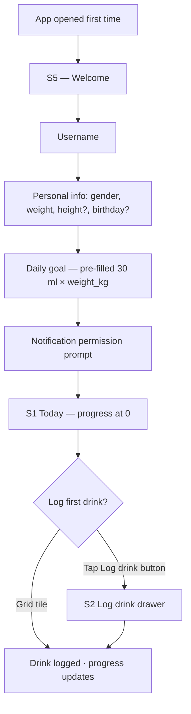
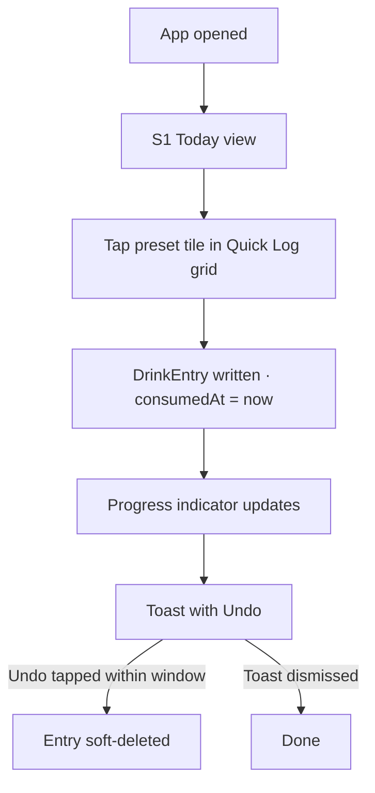
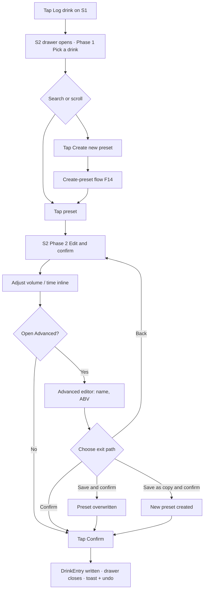
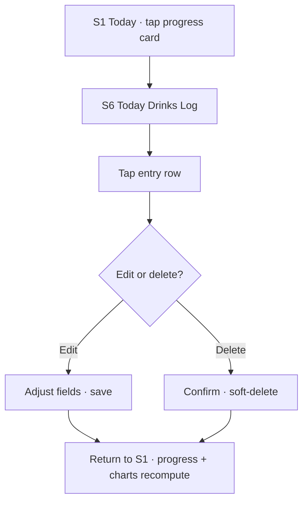
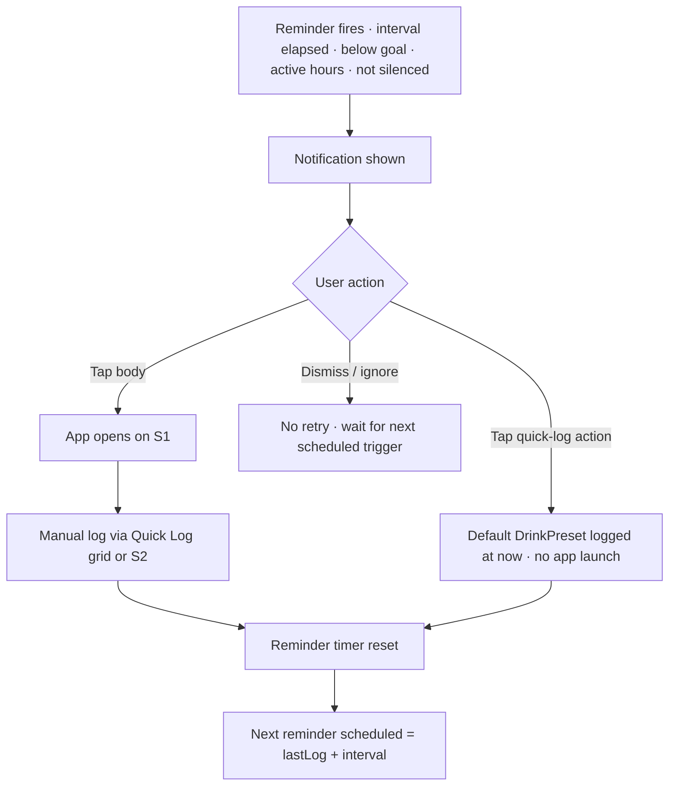

# User Experience

This document describes the screens and primary flows of Drinks Mate. Visual design (colours, typography, exact layouts) is not finalised here — these are the structural requirements the visual design must support.

## Design principles

1. **Logging is the primary action.** The home screen exists to make logging fast. Everything else is secondary.
2. **One thumb, one hand.** Primary actions live in the lower half of the screen so the app is usable one-handed on a phone.
3. **Glanceable progress.** A user should understand their hydration status within a second of opening the app.
4. **Forgiving.** Every log can be edited or deleted. Mistakes are normal and easy to fix.

## Top-level navigation

The app uses a **bottom tab bar** with three tabs, present on every top-level screen:

1. **Today** (default on launch) — hydration tracking.
2. **Party** — Party Session feature; opt-in, secondary.
3. **History** — past intake and sessions.

A **header at the top of every page** carries the page title on the left and a single **settings gear icon** in the top-right corner. Tapping the gear opens Settings (S4). There are no other persistent actions in the header.

Tab bar visibility:

- Visible on Today, Party, and History.
- **Hidden** when the S2 Log drink drawer is open — the drawer covers it.
- Hidden when a full-screen route is pushed from a tab (e.g. Today Drinks Log, day drill-down, Settings).

## Responsive layout

Phase 1 targets phone-sized screens as the primary case (see [designer-brief.md → Design principles](./designer-brief.md#design-principles)), but the S1 Today screen defines three width tiers so the app degrades gracefully on larger surfaces (tablets, unfolded foldables, split-screen/multi-window):

1. **Phone (default), < 600dp** (matching Material's "compact" window-size-class threshold). Single vertical column. The "Quick Log" grid (see S1 below) shows **two tiles per row**.
2. **Wide phone / narrow tablet, 600–839dp.** Still a single vertical column, but the "Quick Log" grid gains a **third column**.
3. **Tablet / desktop width, ≥ 840dp** (matching Material's "expanded" window-size-class threshold). Two-column page layout, split **evenly** (50/50): the progress card and stat cards stay in the left column, and the entire "Quick Log" section (heading, sort dropdown, grid) moves to sit **beside** them in the right column, instead of appearing below them in the vertical stack. Within that narrower right-hand column the grid itself grows to a **fourth column** once its own available width crosses 900dp (this last figure isn't drawn from Material's scale, unlike the other two) — i.e. the grid's column count is driven by the section's own rendered width, not the full screen width, so it can differ from what a bare width check against the screen would suggest on a page that's already split two ways.

## Screens

### S1 — Today (home)

Functional spec: [features.md → F3 Today view](./features.md#f3--today-view).

The default screen on app launch. Header: page title "Today" on the left, settings gear top-right. Hydration is the entire focus of this screen — Party Mode lives on its own tab and never appears here.

Content, top to bottom:

- A **progress card** at the top of the page. Full page width (within the standard horizontal padding). Inside the card, in order:
  - A header row with the **big numeric** intake value (display weight, tabular figures, very large — e.g. `1.4 L`) on the left, the daily goal as a smaller secondary value alongside (e.g. `/ 2.1 L`), and a **status pill** in the top-right of the card carrying a short label: `On pace`, `Behind`, or `Ahead`.
  - A **horizontal progress bar** that fills the entire card width below the header row (within the card's padding). The bar fills left-to-right as the user logs drinks toward today's goal. The fill colour is the brand colour when on or ahead of pace, and the semantic behind-pace colour when behind. A non-colour secondary indicator is required for accessibility (icon or label change on the status pill).
  - A **vertical tick line** on the bar marks the **pace position** — where the user "should be" right now on a linear pace through their active hours. Calculation is the same expected-intake formula used by reminders (see [notifications.md → Recommended volume per reminder](./notifications.md#recommended-volume-per-reminder)). The tick is rendered with a non-colour treatment that is visible against both fill states.
  - The entire card is **tappable**: tapping anywhere on the card opens [S6 Today Drinks Log](#s6--today-drinks-log) as a full-screen push.
- Two **stat cards side-by-side** below the progress card:
  - **7-day daily average** — the user's mean daily intake across the last 7 completed days (excluding today). Format: numeric + unit, e.g. `1.8 L`.
  - **Days on goal (last 7)** — count of days in the last 7 completed days where intake met or exceeded the daily goal. Format: `n/7`, e.g. `5/7`.
- A **"Quick Log" section** (labelled "Log a drink" prior to this revision — renamed for clarity; the header row's title is left-aligned, matching every other section heading on this screen):
  - A **header row** with the "Quick Log" title on the left and a **sort-mode dropdown** on the right: `Manual`, `Recently used` (default), `Most used`. See [features.md → F14 → Sort modes](./features.md#f14--drink-presets-and-customisation) for the ranking rules.
  - Below the header, a grid of the **top 8** presets by the selected mode — small tiles, each showing a preset's icon and name. Tapping a tile logs that preset immediately at the current time with a `Logged` toast and undo affordance (see Toast below). Seeded with defaults until usage data accumulates. Two tiles per row on phone-width screens; wider screens show more columns — see [Responsive layout](#responsive-layout) above. See [features.md → F14](./features.md#f14--drink-presets-and-customisation).
  - **On tablet/desktop-width screens**, the whole "Quick Log" section moves out of the vertical stack and sits beside the progress card and stat cards instead of below them — see [Responsive layout](#responsive-layout).
- A **full-width "Log drink" button** persistent at the bottom of the screen (within the standard horizontal padding, sitting above the tab bar, outside the scroll — see below). Tapping it opens the [S2 Log drink](#s2--log-drink) drawer. This is the path for any drink not in the "Quick Log" grid, including new presets.

**The whole page scrolls as a single vertical scroll** — the progress card, stat cards, and "Quick Log" grid move together; the grid lays out at its full height within that scroll rather than scrolling independently within its own bounded region. Only the "Log drink" button is exempt, staying pinned at the bottom regardless of scroll position. There is no sticky/pinned section header — the "Quick Log" heading scrolls with its content like every other heading on the page.

The `Logged` toast appears at the bottom of the screen (above the tab bar) for 4 seconds with an inline Undo affordance after any preset-tile tap in the "Quick Log" grid or successful S2 confirm.

**Note on naming:** S2's own picker header (below) independently uses the label "Log a drink" for a related but distinct grid — that one is unchanged by this rename. The two surfaces share the same `drinkSortMode` preference but are labelled differently, which is a deliberate, if slightly inconsistent, scoped choice — not an oversight.

### S2 — Log drink

Functional spec: [features.md → F1 Log a drink](./features.md#f1--log-a-drink). Drink presets: [features.md → F14](./features.md#f14--drink-presets-and-customisation).

Reached from the full-width **"Log drink"** button at the bottom of the [S1 Today](#s1--today-home) screen. Presented as a **drawer that opens from the bottom of the screen and may expand to take up the entire screen**. The bottom tab bar is hidden while the drawer is open. The drawer has two phases: pick a drink, then edit and confirm.

#### Phase 1 — Pick a drink

- A **header row** with the "Log a drink" title on the left and its own **sort-mode dropdown** on the right (`Manual` / `Recently used` / `Most used`) — the same shared `drinkSortMode` preference the S1 grid's dropdown reads and writes (one setting, two independent controls), so changing it here also re-ranks the S1 grid. See [features.md → F14 → Sort modes](./features.md#f14--drink-presets-and-customisation).
- A **search field** below the header filters the preset list by name as the user types.
- A **"Create new preset" entry** at the **top** of the list (immediately below the search field, before any preset row) opens the create-preset flow directly — this is a dedicated Phase-1 entry point, distinct from the indirect "save as copy" route in Phase 2's Advanced editor (see [features.md → F14 Drink presets and customisation](./features.md#f14--drink-presets-and-customisation)).
- A **scrollable list** of all visible drink presets (default + user-created, excluding hidden), each row showing its icon (in its configured colour) and its name, ordered by the sort mode selected above.

Tapping a preset advances the drawer to phase 2.

#### Phase 2 — Edit and confirm

The selected preset is shown at the top (icon, name) so the user can confirm what they picked. The bottom of the drawer carries the editing controls and the action row:

- **Quick edits** — `volume` and `time` (defaults to now). Both inline, low-friction.
- **Action row** — at the very bottom of the drawer:
  - **Primary "Confirm" button**, large and full-width by default.
  - **A smaller "Advanced" button to the left of Confirm**, opening an additional editor for `name` and `ABV` (alcoholic drinks only). Only fields the user is likely to want to tweak per-entry — the icon and colour are not editable here; those belong to the preset itself and are changed in "Manage drinks". **Price is not set here at log time, for any drink type** — the entry logs at the preset's regular price (set in "Manage drinks"). It can still be overridden afterwards on a per-entry basis: from [S6](#s6--today-drinks-log) for ordinary entries, or from [S9 Party Session Log](#s9--party-session-log) for alcoholic drinks attached to a Party Session (independent of that session's own session-wide pricing — see [party-session.md → Pricing during a session](./party-session.md#pricing-during-a-session)).

#### Advanced editor

Opening the Advanced editor reveals fields for `name` and `ABV`. After making changes the user has three exit paths:

1. **Back** — discards the advanced edits and returns to phase 2 with the preset's original values.
2. **Confirm** — logs the drink with the entered values **for this entry only**. The underlying preset is unchanged. This is the most common path when the user just needs a one-off variation (e.g. "this particular beer is 7% instead of 5%").
3. **Save and confirm** — writes the advanced values back to the preset (overwriting it), **then** logs the drink. Use case: the user has been incorrectly over-stating their default beer's ABV and wants to fix the preset permanently. Per the [log immutability principle](./data-model.md#snapshot-semantics--log-immutability), saving back to the preset does **not** modify any historical drink entries.
4. **Save as copy and confirm** — creates a **new preset** with the advanced values (the user is asked to confirm the new name), then logs the drink against the new preset. Use case: the user found a new drink they'll want to log again.

Options 3 and 4 are typically offered together as a split button or a small menu attached to the primary save action; "Confirm" remains the primary action on the row when nothing has been edited.

#### State transitions

- Tapping outside the drawer or swiping it down dismisses it without logging anything.
- After a successful confirm (any of the three confirm paths), the drawer closes, the Today screen's progress card updates to reflect the new entry, and a brief "Logged" toast with an undo affordance appears at the bottom of the screen.

### S3 — History

Functional spec: [features.md → F4 History](./features.md#f4--history).

Reached from the **History** tab in the bottom navigation. The screen has:

- A **range selector** at the top: Weekly / Monthly, with paging controls to step backwards and forwards through past periods.
- A stack of **bar charts** for the selected range. Hydration charts are always present; alcohol charts appear only when at least one Party Session overlaps the selected range. See [features.md → F4 History](./features.md#f4--history) for the full chart spec.
- A **day list** below the charts. Tapping a day on any chart, or selecting a row in the list, drills into the day detail (drink list with edit/delete, plus any Party Session summary on that day). **Tapping an entry row opens its edit sheet directly; a delete button on the row is the only other affordance** — there is no separate "Edit" button and no intermediate action menu (same interaction model as S6/S9 below). The edit sheet opens **already expanded to near-full height**, not a short partial sheet the user has to drag open — every editable field is visible immediately without an extra gesture. Editable fields are volume, name, ABV (alcoholic drinks only), price, and time — S3 is the only screen that exposes name; S6 and S9 do not (see their own entries below). **S3 is also the only screen where the date itself is editable**, not just the time-of-day: unlike S6/S9, an entry here can be moved to a different calendar day entirely (e.g. a drink logged just after midnight that should count for the previous day), since S3 is the app's historical-correction surface. The date picker is bounded to never move an entry into the future; there is no lower bound. An alcoholic drink attached to a Party Session (`partySessionId` set) is read-only here (no tap target, no delete button) — edit or delete it from [S9 Party Session Log](#s9--party-session-log) instead, the single authoritative place for session-attached drinks. Delete is a soft-delete with confirmation.
- **The day's Party Session summary is tappable, and expands in place.** Collapsed, it shows the fields it always has (duration, alcoholic drinks count, meals count, peak estimated BAC — see [`SessionSummaryCard`](../flutter/lib/src/widgets/session_summary_card.dart)), all **day-clipped** as today (a session spanning multiple days gets one card per day it touches, each scoped to that day's window — see `SessionDaySummary`/`buildSessionDaySummary`).
  - **Multi-day indicator.** When a session spans more than one calendar day, every card it touches carries a **"Day N of M"** pill (e.g. "Day 2 of 3") on its own line directly below the header row, above Duration — visible in **both** collapsed and expanded states, so the partial, day-sliced nature of the numbers below it is obvious before the user even taps to expand. Rendered as an actual pill, the same rounded-container treatment as [S1's status pill](#s1--today-home) (`_StatusPill`: fully-rounded background, compact padding, short label) — but with **neutral, non-semantic colouring** (a muted container/on-container pairing, not the warning/success tones S1's pill uses), since "Day N of M" isn't a good/bad signal the way pace status is. It gets its own line rather than sharing the header row: S3's header still carries the expand chevron even though it has no edit-name affordance, so the row isn't as free as it first looks, and a long session name would otherwise compete with the pill for space. `N` is this card's position (1-indexed, chronological) among the calendar days the session touches; `M` is the total count of days it touches. A single-day session shows no pill at all.

  Tapping the card expands it in place (accordion-style, no navigation) to also show:
  - **Start and end time** (placed after duration) — the session's actual `startedAt`/`endedAt`, **not** day-clipped. For a multi-day session these are identical on every day card it touches; that's expected, since they're facts about the whole session, not about that day's slice of it.
  - **Total consumed alcohol in grams** (placed after peak BAC), **day-clipped** — only the grams attributable to that specific day, consistent with the collapsed card's existing drinks-count field. The expanded card does **not** show a meals list — the collapsed **meals count** field is the only meals detail this card ever carries.
  - A **static BAC line chart for the session's full lifetime** (placed at the bottom) — solid from `startedAt` to `endedAt`, no dashed projection segment and no "now" marker, since the session has ended. This chart is **not** day-clipped (clipping a decay curve at a day boundary would cut it off mid-curve); for a multi-day session it renders identically on every day card the session touches, same rationale as start/end time above.
  - A **"View full session" button**, at the very bottom of the expanded content (after the BAC chart) — opens [S9 — Party Session Log](#s9--party-session-log) for that session, giving direct access to the whole-session, non-day-clipped view (full itemised drink/meal list, session-scoped totals) from any day card the session touches. S9 opens in whichever mode matches the session's current state (its existing active/ended duality — see [S9](#s9--party-session-log)), same as its other entry points.

  Tapping the card body again (outside the button) collapses it. [S9](#s9--party-session-log)'s own ended-mode header shares this same expand behaviour (see its own entry below) — the two are the only two `SessionSummaryCard` usages that expand; S9's expanded fields are session-scoped rather than day-clipped, since S9 always covers the whole session, so it carries neither the multi-day badge nor the "View full session" button (it *is* the full session view).

Charts are read-only. Editing always happens via the day drill-down or the [today drinks log](#s6--today-drinks-log).

### S4 — Settings

Functional spec: [features.md → F6 Settings](./features.md#f6--settings). Underlying storage: [data-model.md → UserPreferences](./data-model.md#userpreferences) and [→ UserProfile](./data-model.md#userprofile).

Reached by tapping the **settings gear icon** in the top-right of the header on any top-level screen (Today, Party, History). Presented as a full-screen push; the bottom tab bar is hidden while Settings is open. A back affordance returns to the originating tab.

The settings screen is grouped into the following sections, in this order. This list is the canonical settings spec — [features.md → F6 Settings](./features.md#f6--settings) mirrors it.

1. **Hydration**
   - Daily goal (numeric input, ml). Suggested during onboarding from `30 ml × weight_kg` rounded to nearest 100 ml.
   - Day boundary (local time, default 05:00).
2. **Reminders** (see [notifications.md](./notifications.md))
   - Master on/off.
   - Active hours (default 08:00–22:00).
   - Interval (default 90 min).
   - Inactivity reminder toggle (default ON).
   - Weekly summary toggle (default ON).
   - Default drink — reference to a non-alcoholic `DrinkPreset` (default: "Glass of water").
3. **Drinks**
   - Manage drinks — list of drink presets with reorder, edit, hide, delete, and create-new actions. See [features.md → F14 Drink presets and customisation](./features.md#f14--drink-presets-and-customisation).
4. **Profile**
   - Gender (male / female / unspecified).
   - Weight (kg).
   - Height (cm, optional).
   - Birthday (optional but required to use Party Mode).
5. **Party Mode**
   - Personal cap (g/L, optional).
   - "Approaching cap" notification toggle (default OFF).
   - "Sober estimate" notification toggle (default OFF).
   - "Show BAC on lock screen" toggle (default ON).
   - Reference legal limits (informational only — NL 0.5 g/L experienced / 0.2 g/L novice; many EU 0.5 g/L).
6. **Display & format**
   - Units (metric / imperial display).
   - Currency (EUR / USD / GBP).
7. **About / version**.

### S5 — Onboarding (first launch only)

Goal calculation: [features.md → F2](./features.md#f2--daily-hydration-goal). Stored in: [data-model.md → UserPreferences](./data-model.md#userpreferences) and [→ UserProfile](./data-model.md#userprofile).

Onboarding creates a profile that the rest of the app builds on. Steps are presented in this order:

1. **Welcome** — one-line value proposition.
2. **Username** — a short freeform name. Used locally as a friendly label and reserved as the basis for friend discovery in phase 2. `[OPEN]` — allowed length / allowed characters.
3. **Personal info**:
   - **Gender** — three options: *Male*, *Female*, *Prefer not to say*. Defaults to *Prefer not to say* (= `unspecified`) if the user does not change it. The copy explains this is asked for hydration and BAC pharmacokinetic calculations.
   - **Weight** — kilograms. **Required**, defaults to `70 kg`. The user can adjust before continuing.
   - **Height** — centimetres. **Optional**. Improves BAC accuracy in Party Mode (Watson model). Skippable.
   - **Birthday** — date. **Optional in onboarding**, but **required to use Party Mode** (for both the 18+ gate and the Watson age input). Skippable here; the user is asked again the first time they try to start a session.
4. **Daily hydration goal** — pre-filled with the personalised suggestion `30 ml × weight_kg`, rounded to the nearest 100 ml. The user can accept the suggestion or override it. The suggestion is always computed from weight (which is required), so there is no "no weight" fallback case in normal flow.
5. **Notification permission** — request with an honest explanation (reminders to drink). The user can decline and still use the app.

Onboarding is one continuous flow with no skip-everything escape, but each step has a sensible default so a user who taps "next" through the whole thing ends up with a working profile: gender `unspecified`, weight 70 kg, no height, no birthday, daily goal **2100 ml** (= 30 × 70 kg, rounded). The user can revise any of these in settings.

### S6 — Today Drinks Log

Reached by tapping the progress card on [S1 Today](#s1--today-home). Presented as a full-screen push; the bottom tab bar is hidden, a back affordance returns to Today.

Content:

- The same progress card as on Today (read-only at the top, for orientation), or a slimmer summary header carrying today's total intake and goal. Either way, the user keeps their bearings on where they are versus goal while reviewing entries.
- A **list of today's logged drinks**, newest first, of every beverage type — hydration and alcoholic entries alike. Each row shows the drink's icon (tinted in its configured colour), name, volume, and time of consumption.
- **Tapping a row opens its edit sheet directly; a delete button on the row is the only other affordance** — there is no separate "Edit" button and no intermediate action menu. The edit sheet opens **already expanded to near-full height**, not a short partial sheet the user has to drag open — every editable field is visible immediately without an extra gesture. This applies to every entry **except** an alcoholic drink attached to a Party Session (`partySessionId` set) — those rows are read-only here (no tap target, no delete button); edit or delete them from [S9 Party Session Log](#s9--party-session-log) instead, the single authoritative place for session-attached drinks. Editable fields (where editing is allowed) are volume, ABV (alcoholic drinks only), price, and time — **not name**; the [History day drill-down](#s3--history) is the only screen that additionally exposes name. Delete is a soft-delete with confirmation.
- An empty state appears when the user has logged nothing yet today: an illustration plus a friendly one-line prompt and a button to log a drink (opens the S2 drawer).

Entries edited or deleted here cause the progress card on S1 to recompute on return.

### S7 — Party

Functional spec: [features.md → F12 Party Session](./features.md#f12--party-session-opt-in). Full feature design: [party-session.md](./party-session.md).

Reached from the **Party** tab in the bottom navigation. Header: page title "Party" on the left, settings gear top-right. The content depends on whether a session is currently active.

#### No active session — first-run state

The first time the user opens the Party tab, the screen presents a brief explainer plus the start action:

- A short, honest explainer of what Party Mode is: opt-in session-based alcohol tracking with a BAC estimate. Includes the "this is an estimate, not a measurement" disclaimer required by [party-session.md](./party-session.md#important-this-is-an-estimate-not-a-measurement).
- A **full-width "Start party session" button**, full page width (within standard padding).
- Reference to the personal cap setting (deep-link to Settings → Party Mode), but no in-screen configuration.

#### No active session — subsequent visits

After the user has seen the explainer at least once (i.e. has ever opened the Party tab before, regardless of whether they started a session), the explainer is no longer shown by default. Instead:

- A **full-width "Start party session" button** at the top of the content area.
- A **past sessions list** below the button. Each row shows, on one line, the session's **name if one was set** (before the date — see [data-model.md → PartySession.name](./data-model.md#partysession)) followed by session date / range, then peak BAC, number of alcoholic drinks, and how the session ended (manual / auto). A row with no name just starts with the date. Tapping a row opens [S9 — Party Session Log](#s9--party-session-log) in its read-only, ended-session mode. **Rows carry no delete affordance** — deleting an ended session is done from [S9's ended-mode header](#s9--party-session-log), the single entry point for that action (see [party-session.md → Deleting a session](./party-session.md#deleting-a-session)).
- An "i" / info affordance on the header re-opens the explainer if the user wants to revisit it.

#### Active session

When a session is active, the Party tab displays the active-session view. Its full content list — summary card (BAC in g/L with mmol/L alongside, cap progress, elapsed time, session name if set), BAC line chart, alcohol quick-log widget, drinks-this-session count, total grams of alcohol, meal indicator, session-prices control, session totals, and the sticky "Log alcohol" / in-flow "End session" actions — is the canonical [party-session.md → Party tab during a session](./party-session.md#party-tab-during-a-session) list. Treat that list as authoritative; this S7 description does not duplicate it. Both the summary card and the drinks-count / total-grams line are tappable and open [S9 — Party Session Log](#s9--party-session-log) in its editable, active-session mode; the BAC chart is not part of that tap target — it has its own tap-to-inspect-value interaction instead (see [party-session.md → BAC line chart](./party-session.md#bac-line-chart)).

Starting a session may open profile prompts (birthday, optional height) and the meal / pricing prompts before reaching the active view — see [party-session.md → Starting a session](./party-session.md#starting-a-session).

### S9 — Party Session Log

Functional spec: [features.md → F12 Party Session](./features.md#f12--party-session-opt-in). Full feature design: [party-session.md](./party-session.md).

One screen serves both an active session and any ended session — it is the drill-down target from both entry points below, and doubles as the "session summary view" referenced from the past-sessions list. Presented as a full-screen push; the bottom tab bar is hidden, a back affordance returns to the Party tab.

Reached two ways:

- **Active session:** tapping the summary card or the drinks-count / total-grams line on the Party tab's active-session view (see [party-session.md → Party tab during a session](./party-session.md#party-tab-during-a-session)) opens this screen in its **editable** mode.
- **Ended session:** tapping a row in the Party tab's past-sessions list (see [S7 → No active session — subsequent visits](#no-active-session--subsequent-visits)) opens this screen in its **read-only** mode for that session.

Content:

- A summary header for orientation, showing the session's **name** if one is set (tappable to add/edit one in either mode — see [party-session.md → Starting a session](./party-session.md#starting-a-session)). Active-session mode: current BAC (g/L, mmol/L alongside), drinks-this-session count, and time elapsed — a slimmer echo of the Party tab's own header, the same relationship S6 has to Today's progress card. Ended-session mode: session duration, total alcoholic drinks, meals logged, and peak estimated BAC — the same fields already shown on the History day drill-down's session summary card ([features.md → Day drill-down](./features.md#day-drill-down)). **Like that History card, this header is tappable and expands in place** (accordion-style, no navigation) to additionally show start and end time (after duration), total consumed alcohol in grams (after peak BAC), and a static full-session BAC chart — session-scoped, not day-clipped, since S9 always covers the whole session. Unlike the History card, the expanded header never shows a meals list — S9 surfaces meals in its entry list instead (see below). Ended-session mode also carries a **delete-session action** (with confirmation) — see [party-session.md → Deleting a session](./party-session.md#deleting-a-session).
- A **list of the session's alcoholic drink entries, merged with the meals logged during it**, newest first. Drink rows include drinks logged directly within the session **and** orphan drinks absorbed into it (see [party-session.md → Absorbing orphan drinks](./party-session.md#absorbing-orphan-drinks-when-a-later-session-starts)); each shows the drink's icon (tinted), name, volume, ABV, and time of consumption. Meal rows are interleaved chronologically with the drink rows and are visually distinct (meal icon, size, and time), but are always **display-only** — meals stay editable only from the Party tab's meal indicator, never from here.
- **Scoped by session, not by calendar day.** The query is "every `DrinkEntry` with this `partySessionId`," unlike S6 which is scoped to today's day window. This is what makes S9 work correctly for a session that spans a day boundary (e.g. starts at 23:00 and continues past midnight) and for absorbed orphans logged on an earlier calendar day (see [party-session.md → Absorbing orphan drinks](./party-session.md#absorbing-orphan-drinks-when-a-later-session-starts) — "absorbed orphans extend backwards in time"). Neither case is fully addressable via S6 alone, which is why S9 exists as a distinct screen.
- **Alcoholic drinks only, plus meals.** Non-alcoholic drinks logged during the session's window are not shown here — hydration stays exclusively in S1/S6.
- **Active-session mode:** this applies to **drink rows only** — meal rows are always display-only, in both modes (see above). Tapping a drink row opens its edit sheet directly; a delete button on the row is the only other affordance — same interaction model as S6/S3, no separate "Edit" button and no intermediate action menu. The edit sheet opens **already expanded to near-full height**, not a short partial sheet the user has to drag open — every editable field is visible immediately without an extra gesture (same as S3/S6, which share this edit sheet). Editable fields are volume, ABV, price, and time — not name, mirroring S6's edit affordance (every S9 entry is alcoholic, so ABV is always shown here, unlike S6/S3 where it only appears for alcoholic entries). The time edit here can move an entry across a calendar day boundary (a session can span midnight) but, unlike S3, is **bounded to the session's own window** — from `session.startedAt` through now, except for an absorbed orphan drink, whose floor is its own (earlier) `consumedAt` instead, since absorbed orphans "extend backwards in time" (see [party-session.md → Absorbing orphan drinks](./party-session.md#absorbing-orphan-drinks-when-a-later-session-starts)) and must stay editable at their real, pre-session timestamp. Moving a session-attached entry outside that bound would otherwise break that session's BAC/duration math, so this is deliberately never as unrestricted as S3's historical-correction editing. A price edit here is a **one-off, this-entry-only** override, same as S6; it is independent of the session-wide `PartySessionPrice` override editable from the Party tab's "Manage prices" screen (see [party-session.md → Editing prices during a session](./party-session.md#editing-prices-during-a-session)) — editing one does not change the other. Delete is a soft-delete with confirmation; deleting an absorbed orphan permanently deletes the drink (it does not revert to orphan status — there is one delete semantic, matching S6).
- **Ended-session mode:** rows are display-only. No edit / delete affordance on individual drinks — a session's drink history does not change after the fact (the session itself can still be deleted wholesale — see the delete-session action above, which detaches rather than deletes the drinks).
- An empty state appears if the session has no alcoholic drinks yet (e.g. a session started manually before any drink is logged): a friendly one-line prompt, plus — active-session mode only — a button that opens the Party tab's log-alcohol sheet. Note that a session ending with zero drinks is discarded outright rather than reaching this state in ended-session mode — see [party-session.md → Zero-drink sessions are never saved](./party-session.md#zero-drink-sessions-are-never-saved).

Entries edited or deleted here (active-session mode) recompute the BAC estimate and the Party tab's active-session view on return.

**Interaction with S6:** once S6 stops excluding alcoholic drinks, a session-attached alcoholic entry may appear in both S6 (if logged today) and S9. S6 shows it read-only there — tapping it does not open an edit affordance. S9 is the single authoritative place to edit or delete a session-attached alcoholic drink. S6 remains the authoritative place for orphan alcoholic entries and all non-alcoholic entries.

## Key flows

### Flow 1 — First-time use

1. User opens the app for the first time.
2. Onboarding (S5) runs — under 30 seconds end to end.
3. User lands on the today view (S1) with their goal set and progress at 0.
4. User logs their first drink via a tile in the "Quick Log" grid or the full-width Log drink button.

The 60-second goal from the success criteria applies here.

### Flow 2 — Quick log (most common)

1. User opens the app.
2. Taps a preset tile in the "Quick Log" grid on the today view (e.g. "200 ml water").
3. The drink is logged at the current time. Progress updates immediately. A brief toast or similar confirms the action with an undo affordance.

Two taps total (open the app, tap the tile). Alcoholic presets still log immediately; the toast swaps in "Start session" for Undo only when no session is active yet — see [party-session.md → Logging from Today](./party-session.md#logging-from-today-quick-log-tile-and-s2-drawer).

### Flow 3 — Detailed log

1. User opens the app and taps "Log drink".
2. User picks a preset, optionally tweaks volume / time, optionally opens the Advanced editor for name / ABV.
3. User confirms; the drink is added to today's list and progress updates.

### Flow 4 — Correcting a mistake

1. User taps the progress card on [S1 Today](#s1--today-home).
2. [S6 Today Drinks Log](#s6--today-drinks-log) opens (full-screen push).
3. User taps an entry in the list.
4. User edits volume, name, ABV (if alcoholic), price, or time, or deletes the entry.
5. User returns to Today; the progress card recomputes.

### Flow 5 — Responding to a reminder

1. User receives a reminder notification.
2. User can: (a) tap the body — app opens on S1 ready to log; or (b) tap the inline "Log {default_drink}" action — drink logged in place without opening the app.
3. Either path resets the reminder timer; the next reminder fires `interval` later.

## Accessibility

- All interactive elements must have accessible labels.
- The app must support the system's dynamic text sizes.
- Colour must not be the sole indicator of state (e.g. goal-met should also have an icon or text label, not only a colour change).
- The app should work with VoiceOver (iOS) and TalkBack (Android).
