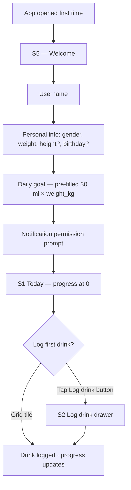
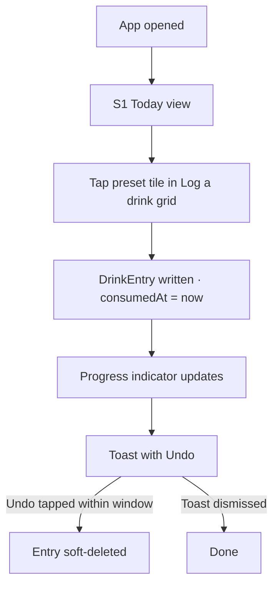
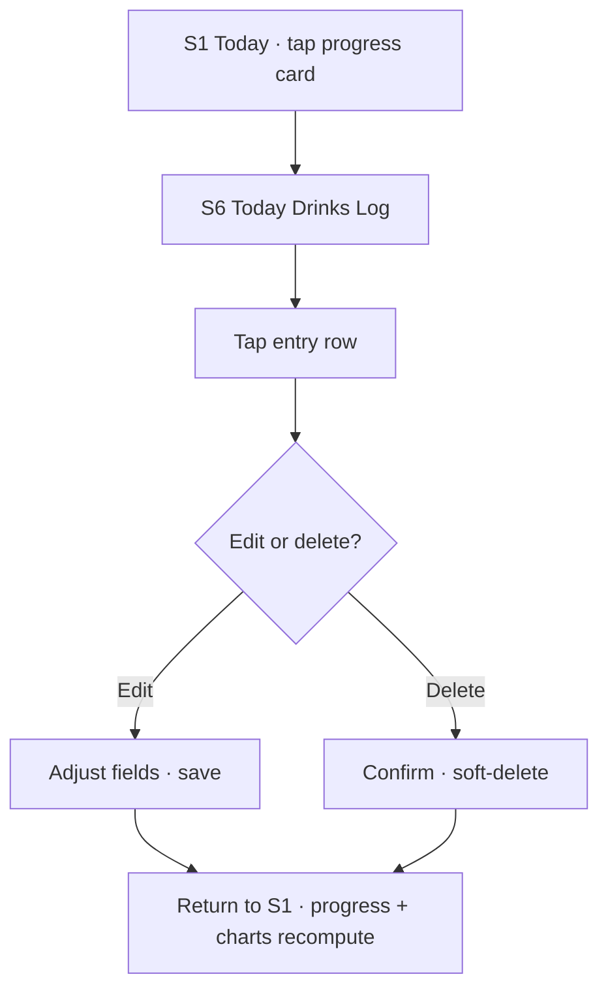
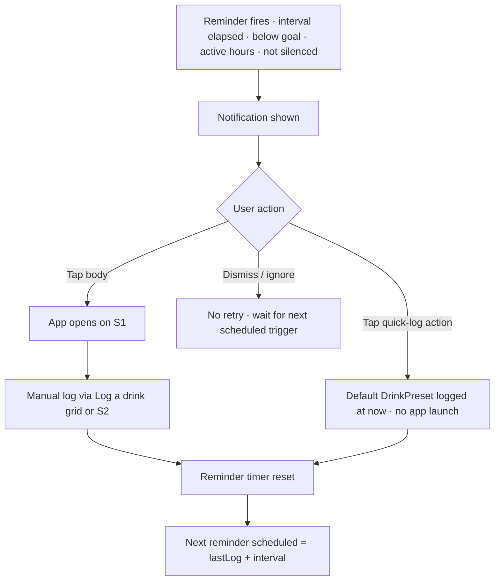

# User Experience

This document describes the screens and primary flows of Drinks Mate. Visual design (colours, typography, exact layouts) is not finalised here — these are the structural requirements the visual design must support.

## Design principles

1. **Logging is the primary action.** The home screen exists to make logging fast. Everything else is secondary.
2. **One thumb, one hand.** Primary actions live in the lower half of the screen so the app is usable one-handed on a phone.
3. **Glanceable progress.** A user should understand their hydration status within a second of opening the app.
4. **Forgiving.** Every log can be edited or deleted. Mistakes are normal and easy to fix.

## Top-level navigation

The app uses a **bottom tab bar** with three tabs, present on every top-level screen:

1. **Today** (default on launch) — hydration tracking.
2. **Party** — Party Session feature; opt-in, secondary.
3. **History** — past intake and sessions.

A **header at the top of every page** carries the page title on the left and a single **settings gear icon** in the top-right corner. Tapping the gear opens Settings (S4). There are no other persistent actions in the header.

Tab bar visibility:

- Visible on Today, Party, and History.
- **Hidden** when the S2 Log drink drawer is open — the drawer covers it.
- Hidden when a full-screen route is pushed from a tab (e.g. Today Drinks Log, day drill-down, Settings).

## Responsive layout

Phase 1 targets phone-sized screens as the primary case (see [designer-brief.md → Design principles](./designer-brief.md#design-principles)), but the S1 Today screen defines three width tiers so the app degrades gracefully on larger surfaces (tablets, unfolded foldables, split-screen/multi-window):

1. **Phone (default).** Single vertical column. The "Log a drink" grid (see S1 below) shows **two tiles per row**.
2. **Wide phone / narrow tablet.** Still a single vertical column, but the "Log a drink" grid gains **more columns** as width allows.
3. **Tablet / desktop width.** Two-column page layout: the progress card and stat cards stay on the left, and the entire "Log a drink" section (heading, sort dropdown, grid) moves to sit **beside** them on the right, instead of appearing below them in the vertical stack.

`[OPEN]` — exact breakpoints (in logical pixels) for tiers 2 and 3, and the exact column counts per tier.

## Screens

### S1 — Today (home)

Functional spec: [features.md → F3 Today view](./features.md#f3--today-view).

The default screen on app launch. Header: page title "Today" on the left, settings gear top-right. Hydration is the entire focus of this screen — Party Mode lives on its own tab and never appears here.

Content, top to bottom:

- A **progress card** at the top of the page. Full page width (within the standard horizontal padding). Inside the card, in order:
  - A header row with the **big numeric** intake value (display weight, tabular figures, very large — e.g. `1.4 L`) on the left, the daily goal as a smaller secondary value alongside (e.g. `/ 2.1 L`), and a **status pill** in the top-right of the card carrying a short label: `On pace`, `Behind`, or `Ahead`.
  - A **horizontal progress bar** that fills the entire card width below the header row (within the card's padding). The bar fills left-to-right as the user logs drinks toward today's goal. The fill colour is the brand colour when on or ahead of pace, and the semantic behind-pace colour when behind. A non-colour secondary indicator is required for accessibility (icon or label change on the status pill).
  - A **vertical tick line** on the bar marks the **pace position** — where the user "should be" right now on a linear pace through their active hours. Calculation is the same expected-intake formula used by reminders (see [notifications.md → Recommended volume per reminder](./notifications.md#recommended-volume-per-reminder)). The tick is rendered with a non-colour treatment that is visible against both fill states.
  - The entire card is **tappable**: tapping anywhere on the card opens [S6 Today Drinks Log](#s6--today-drinks-log) as a full-screen push.
- Two **stat cards side-by-side** below the progress card:
  - **7-day daily average** — the user's mean daily intake across the last 7 completed days (excluding today). Format: numeric + unit, e.g. `1.8 L`.
  - **Days on goal (last 7)** — count of days in the last 7 completed days where intake met or exceeded the daily goal. Format: `n/7`, e.g. `5/7`.
- A **"Log a drink" section**:
  - A **header row** with the "Log a drink" title on the left and a **sort-mode dropdown** on the right: `Manual`, `Recently used` (default), `Most used`. See [features.md → F14 → Sort modes](./features.md#f14--drink-presets-and-customisation) for the ranking rules.
  - Below the header, a **vertically-scrolling grid** of the **top 8** presets by the selected mode — small tiles, each showing a preset's icon and name. Tapping a tile logs that preset immediately at the current time with a `Logged` toast and undo affordance (see Toast below). Seeded with defaults until usage data accumulates. Two tiles per row on phone-width screens; wider screens show more columns — see [Responsive layout](#responsive-layout) above. See [features.md → F14](./features.md#f14--drink-presets-and-customisation).
  - **On tablet/desktop-width screens**, the whole "Log a drink" section moves out of the vertical stack and sits beside the progress card and stat cards instead of below them — see [Responsive layout](#responsive-layout).
- A **full-width "Log drink" button** persistent at the bottom of the screen (within the standard horizontal padding, sitting above the tab bar). Tapping it opens the [S2 Log drink](#s2--log-drink) drawer. This is the path for any drink not in the "Log a drink" grid, including new presets.

The `Logged` toast appears at the bottom of the screen (above the tab bar) for 4 seconds with an inline Undo affordance after any preset-tile tap in the "Log a drink" grid or successful S2 confirm.

### S2 — Log drink

Functional spec: [features.md → F1 Log a drink](./features.md#f1--log-a-drink). Drink presets: [features.md → F14](./features.md#f14--drink-presets-and-customisation).

Reached from the full-width **"Log drink"** button at the bottom of the [S1 Today](#s1--today-home) screen. Presented as a **drawer that opens from the bottom of the screen and may expand to take up the entire screen**. The bottom tab bar is hidden while the drawer is open. The drawer has two phases: pick a drink, then edit and confirm.

#### Phase 1 — Pick a drink

- A **search field** at the top filters the preset list by name as the user types.
- A **scrollable list** of all visible drink presets (default + user-created, excluding hidden), each row showing its icon (in its configured colour) and its name. The list uses the same **sort mode** selected on the S1 "Log a drink" grid (Manual / Recently used / Most used) — see [features.md → F14 → Sort modes](./features.md#f14--drink-presets-and-customisation).
- A **"Create new preset"** action at the end of the list opens the create-preset flow (see [features.md → F14 Drink presets and customisation](./features.md#f14--drink-presets-and-customisation)).

Tapping a preset advances the drawer to phase 2.

#### Phase 2 — Edit and confirm

The selected preset is shown at the top (icon, name) so the user can confirm what they picked. The bottom of the drawer carries the editing controls and the action row:

- **Quick edits** — `volume` and `time` (defaults to now). Both inline, low-friction.
- **Action row** — at the very bottom of the drawer:
  - **Primary "Confirm" button**, large and full-width by default.
  - **A smaller "Advanced" button to the left of Confirm**, opening an additional editor for `name`, `ABV` (alcoholic drinks only), and `price`. Only fields the user is likely to want to tweak per-entry — the icon and colour are not editable here; those belong to the preset itself and are changed in "Manage drinks".

#### Advanced editor

Opening the Advanced editor reveals fields for `name`, `ABV`, and `price`. After making changes the user has three exit paths:

1. **Back** — discards the advanced edits and returns to phase 2 with the preset's original values.
2. **Confirm** — logs the drink with the entered values **for this entry only**. The underlying preset is unchanged. This is the most common path when the user just needs a one-off variation (e.g. "this particular beer is 7% instead of 5%").
3. **Save and confirm** — writes the advanced values back to the preset (overwriting it), **then** logs the drink. Use case: the user has been incorrectly over-stating their default beer's ABV and wants to fix the preset permanently. Per the [log immutability principle](./data-model.md#snapshot-semantics--log-immutability), saving back to the preset does **not** modify any historical drink entries.
4. **Save as copy and confirm** — creates a **new preset** with the advanced values (the user is asked to confirm the new name), then logs the drink against the new preset. Use case: the user found a new drink they'll want to log again.

Options 3 and 4 are typically offered together as a split button or a small menu attached to the primary save action; "Confirm" remains the primary action on the row when nothing has been edited.

#### State transitions

- Tapping outside the drawer or swiping it down dismisses it without logging anything.
- After a successful confirm (any of the three confirm paths), the drawer closes, the Today screen's progress card updates to reflect the new entry, and a brief "Logged" toast with an undo affordance appears at the bottom of the screen.

### S3 — History

Functional spec: [features.md → F4 History](./features.md#f4--history).

Reached from the **History** tab in the bottom navigation. The screen has:

- A **range selector** at the top: Weekly / Monthly, with paging controls to step backwards and forwards through past periods.
- A stack of **bar charts** for the selected range. Hydration charts are always present; alcohol charts appear only when at least one Party Session overlaps the selected range. See [features.md → F4 History](./features.md#f4--history) for the full chart spec.
- A **day list** below the charts. Tapping a day on any chart, or selecting a row in the list, drills into the day detail (drink list with edit/delete, plus any Party Session summary on that day).

Charts are read-only. Editing always happens via the day drill-down or the [today drinks log](#s6--today-drinks-log).

### S4 — Settings

Functional spec: [features.md → F6 Settings](./features.md#f6--settings). Underlying storage: [data-model.md → UserPreferences](./data-model.md#userpreferences) and [→ UserProfile](./data-model.md#userprofile).

Reached by tapping the **settings gear icon** in the top-right of the header on any top-level screen (Today, Party, History). Presented as a full-screen push; the bottom tab bar is hidden while Settings is open. A back affordance returns to the originating tab.

The settings screen is grouped into the following sections, in this order. This list is the canonical settings spec — [features.md → F6 Settings](./features.md#f6--settings) mirrors it.

1. **Hydration**
   - Daily goal (numeric input, ml). Suggested during onboarding from `30 ml × weight_kg` rounded to nearest 100 ml.
   - Day boundary (local time, default 05:00).
2. **Reminders** (see [notifications.md](./notifications.md))
   - Master on/off.
   - Active hours (default 08:00–22:00).
   - Interval (default 90 min).
   - Inactivity reminder toggle (default ON).
   - Weekly summary toggle (default ON).
   - Default drink — reference to a non-alcoholic `DrinkPreset` (default: "Glass of water").
3. **Drinks**
   - Manage drinks — list of drink presets with reorder, edit, hide, delete, and create-new actions. See [features.md → F14 Drink presets and customisation](./features.md#f14--drink-presets-and-customisation).
4. **Profile**
   - Gender (male / female / unspecified).
   - Weight (kg).
   - Height (cm, optional).
   - Birthday (optional but required to use Party Mode).
5. **Party Mode**
   - Personal cap (g/L, optional).
   - "Approaching cap" notification toggle (default OFF).
   - "Sober estimate" notification toggle (default OFF).
   - "Show BAC on lock screen" toggle (default ON).
   - Reference legal limits (informational only — NL 0.5 g/L experienced / 0.2 g/L novice; many EU 0.5 g/L).
6. **Display & format**
   - Units (metric / imperial display).
   - Currency (EUR / USD / GBP).
7. **About / version**.

### S5 — Onboarding (first launch only)

Goal calculation: [features.md → F2](./features.md#f2--daily-hydration-goal). Stored in: [data-model.md → UserPreferences](./data-model.md#userpreferences) and [→ UserProfile](./data-model.md#userprofile).

Onboarding creates a profile that the rest of the app builds on. Steps are presented in this order:

1. **Welcome** — one-line value proposition.
2. **Username** — a short freeform name. Used locally as a friendly label and reserved as the basis for friend discovery in phase 2. `[OPEN]` — allowed length / allowed characters.
3. **Personal info**:
   - **Gender** — three options: *Male*, *Female*, *Prefer not to say*. Defaults to *Prefer not to say* (= `unspecified`) if the user does not change it. The copy explains this is asked for hydration and BAC pharmacokinetic calculations.
   - **Weight** — kilograms. **Required**, defaults to `70 kg`. The user can adjust before continuing.
   - **Height** — centimetres. **Optional**. Improves BAC accuracy in Party Mode (Watson model). Skippable.
   - **Birthday** — date. **Optional in onboarding**, but **required to use Party Mode** (for both the 18+ gate and the Watson age input). Skippable here; the user is asked again the first time they try to start a session.
4. **Daily hydration goal** — pre-filled with the personalised suggestion `30 ml × weight_kg`, rounded to the nearest 100 ml. The user can accept the suggestion or override it. The suggestion is always computed from weight (which is required), so there is no "no weight" fallback case in normal flow.
5. **Notification permission** — request with an honest explanation (reminders to drink). The user can decline and still use the app.

Onboarding is one continuous flow with no skip-everything escape, but each step has a sensible default so a user who taps "next" through the whole thing ends up with a working profile: gender `unspecified`, weight 70 kg, no height, no birthday, daily goal **2100 ml** (= 30 × 70 kg, rounded). The user can revise any of these in settings.

### S6 — Today Drinks Log

Reached by tapping the progress card on [S1 Today](#s1--today-home). Presented as a full-screen push; the bottom tab bar is hidden, a back affordance returns to Today.

Content:

- The same progress card as on Today (read-only at the top, for orientation), or a slimmer summary header carrying today's total intake and goal. Either way, the user keeps their bearings on where they are versus goal while reviewing entries.
- A **list of today's logged drinks**, newest first. Each row shows the drink's icon (tinted in its configured colour), name, volume, and time of consumption.
- Tapping a row opens an **edit / delete** affordance for that entry. Editable fields are volume, name, ABV (alcoholic drinks only), price, and time. Delete is a soft-delete with confirmation.
- An empty state appears when the user has logged nothing yet today: an illustration plus a friendly one-line prompt and a button to log a drink (opens the S2 drawer).

Entries edited or deleted here cause the progress card on S1 to recompute on return.

### S7 — Party

Functional spec: [features.md → F12 Party Session](./features.md#f12--party-session-opt-in). Full feature design: [party-session.md](./party-session.md).

Reached from the **Party** tab in the bottom navigation. Header: page title "Party" on the left, settings gear top-right. The content depends on whether a session is currently active.

#### No active session — first-run state

The first time the user opens the Party tab, the screen presents a brief explainer plus the start action:

- A short, honest explainer of what Party Mode is: opt-in session-based alcohol tracking with a BAC estimate. Includes the "this is an estimate, not a measurement" disclaimer required by [party-session.md](./party-session.md#important-this-is-an-estimate-not-a-measurement).
- A **full-width "Start party session" button**, full page width (within standard padding).
- Reference to the personal cap setting (deep-link to Settings → Party Mode), but no in-screen configuration.

#### No active session — subsequent visits

After the user has seen the explainer at least once (i.e. has ever opened the Party tab before, regardless of whether they started a session), the explainer is no longer shown by default. Instead:

- A **full-width "Start party session" button** at the top of the content area.
- A **past sessions list** below the button. Each row shows session date / range, peak BAC, number of alcoholic drinks, and how the session ended (manual / auto). Tapping a row drills into a session summary view.
- An "i" / info affordance on the header re-opens the explainer if the user wants to revisit it.

#### Active session

When a session is active, the Party tab displays the active-session view. Its full content list — current BAC in g/L with mmol/L alongside, BAC line chart, cap progress, drinks-this-session count, total grams of alcohol, time elapsed, meal indicator, session-prices control, session totals, and the End session action — is the canonical [party-session.md → Party tab during a session](./party-session.md#party-tab-during-a-session) list. Treat that list as authoritative; this S7 description does not duplicate it.

Starting a session may open profile prompts (birthday, optional height) and the meal / pricing prompts before reaching the active view — see [party-session.md → Starting a session](./party-session.md#starting-a-session).

## Key flows

### Flow 1 — First-time use

1. User opens the app for the first time.
2. Onboarding (S5) runs — under 30 seconds end to end.
3. User lands on the today view (S1) with their goal set and progress at 0.
4. User logs their first drink via a tile in the "Log a drink" grid or the full-width Log drink button.

The 60-second goal from the success criteria applies here.

### Flow 2 — Quick log (most common)

1. User opens the app.
2. Taps a preset tile in the "Log a drink" grid on the today view (e.g. "200 ml water").
3. The drink is logged at the current time. Progress updates immediately. A brief toast or similar confirms the action with an undo affordance.

Two taps total (open the app, tap the tile).

### Flow 3 — Detailed log

1. User opens the app and taps "Log drink".
2. User picks a preset, optionally tweaks volume / time, optionally opens the Advanced editor for name / ABV / price.
3. User confirms; the drink is added to today's list and progress updates.

### Flow 4 — Correcting a mistake

1. User taps the progress card on [S1 Today](#s1--today-home).
2. [S6 Today Drinks Log](#s6--today-drinks-log) opens (full-screen push).
3. User taps an entry in the list.
4. User edits volume, name, ABV (if alcoholic), price, or time, or deletes the entry.
5. User returns to Today; the progress card recomputes.

### Flow 5 — Responding to a reminder

1. User receives a reminder notification.
2. User can: (a) tap the body — app opens on S1 ready to log; or (b) tap the inline "Log {default_drink}" action — drink logged in place without opening the app.
3. Either path resets the reminder timer; the next reminder fires `interval` later.

## Accessibility

- All interactive elements must have accessible labels.
- The app must support the system's dynamic text sizes.
- Colour must not be the sole indicator of state (e.g. goal-met should also have an icon or text label, not only a colour change).
- The app should work with VoiceOver (iOS) and TalkBack (Android).
